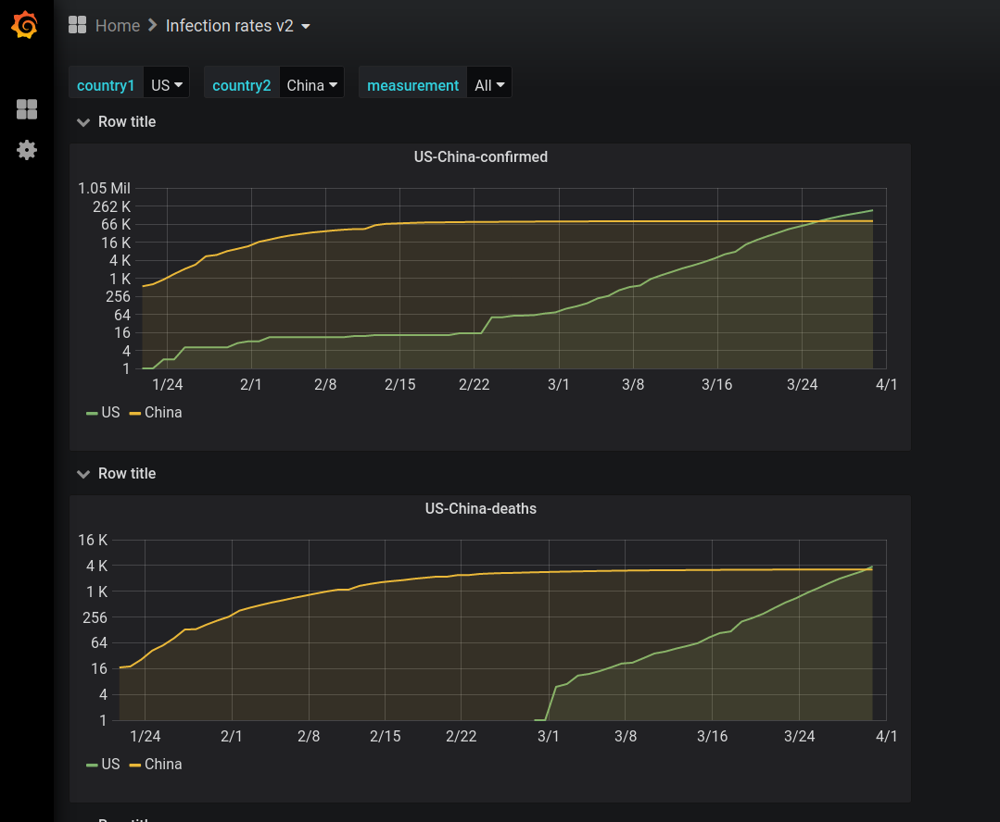

Grafana dashboard for anything related to covid-19. Currently just testing it out with daily reports from https://github.com/CSSEGISandData/COVID-19/. 

No guarantees on availability or correctness. 

[Link to dashboard](pandemicmonitor.westus2.azurecontainer.io:3000/) 

and sample screenshot:



Alternatively you can run this locally with docker which will provision the existing dashboards automatically

```
docker build . -t etl:latest
docker build grafana -t grafana:local
docker-compose up
```
